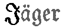
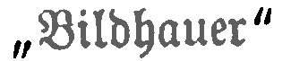

# Fraktur model for OCRopus

This is a character model for recognizing Fraktur font with [OCRopus](https://github.com/tmbdev/ocropy). 

With test data that has not been used in the training process it yields an excellent error rate of 1.089%. The 'standard' Fraktur model shows an error rate of 3.14% for the same test data.

In addition to the pyrnn.gz model to be used with `ocropus-rpred` I have also trained a character model for [CLSTM](https://github.com/tmbdev/clstm). 

## Sources

The ground truth images for this model were selected from these historic books:

- Das astronomische Weltbild im Wandel der Zeit (1912) urn:nbn:at:AT-OOeLB-4113427
- Topographische Chronik von Breslau  (1805)
- Egger: Die christliche Mutter (1914)
- Frapan: Bittersüß (1891)
- Gartenlaube Heft 1, S. 8 (1897)
- Kiel city directory (1888)
- Was sollen wir kochen? (1915)  urn:nbn:at:AT-OOeLB-1184253
- Köln city directory (1891)
- Ludendorff: Kriegserinnerungen (1921)
- Menzel: Der praktische Maurer  (1847)
- Kreis-Kalender für den Kreis Plön (1909) urn:nbn:de:gbv:8:2-2533517
- Preuschen: Yoshiwara (1920)
- Schiller und Oberösterreich (1905) urn:nbn:at:AT-OOeLB-1099695
- Ehrenbuch der Gefallenen Stuttgarts (1925)

For some rare characters (Q, Y, Ä, Ö and Ü) I have generated some synthetic training data with OCRopus-linegen using the Walbaum Fraktur font and words from a German dictionary.

In addition, samples from these documents are included for testing the robustness of the model:

- Peters: Wisch und Umgegend (1898) 
- Internationaler Funkentelegraphenvertrag (1906)
- Das Inselschiff, eine Zeitschrift für Freunde der Literatur und des schönen Buches, page 23 (1914)

## Special characters

### I and J

A problem with Fraktur are the upper-case letters I and J. For many Fraktur fonts they are indistinguishable. For example, compare the I in Im and the J in Jäger:

However, for a neuronal network two indistinguishable but different characters are a big problem. Therefore, it might be better to decide on one letter to avoid the ambiguity. I suggest the uppercase I. As a consequence every J will be recognized as I. The result will be some strange words such as "Iuly". 

Using a language model you can easily replace the wrong characters. In German an uppercase J is usually followed by a lowercase vowel. 

### s, tz, ch, ck and others

Fraktur has a few special characters that usually do not occur in 'normal' text, such as the long-S or the tz ligature. This model (and the ground truth) translates them into 'normal' characters. Therefore a long-S will be interpreted as s and the ligatures will be interpreted as two characters.

### Quotation mark

Often you will find two different kind of quotation marks. The opening lower quotation marks the closing upper quotation marks.

I decided to distinguish between the two kind of quotation marks. 

- opening: „
- closing: “

Therefore, the image above becomes „Bildhauer“.

## Training
### ocropy
To train the model from scratch you can use this command:

	ocropus-rtrain -c codec.txt -F 2000 -o fraktur "training/*.bin.png"

(Make sure that the OCRopus directory is included in PATH.) If you want to improve the existing model you can start with it:

	ocropus-rtrain -c codec.txt -F 2000 --load fraktur.pyrnn.gz -o fraktur "training/*.bin.png"
